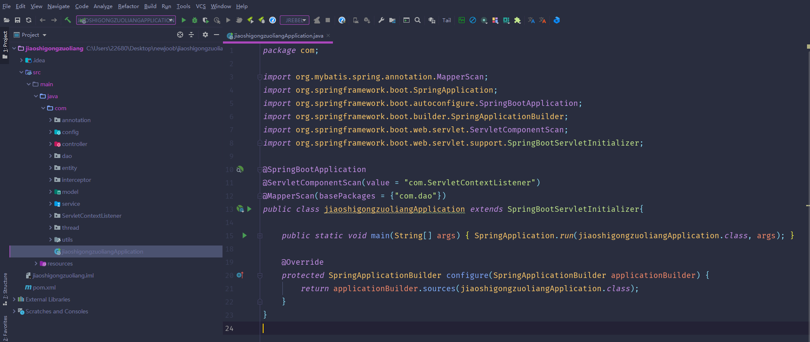
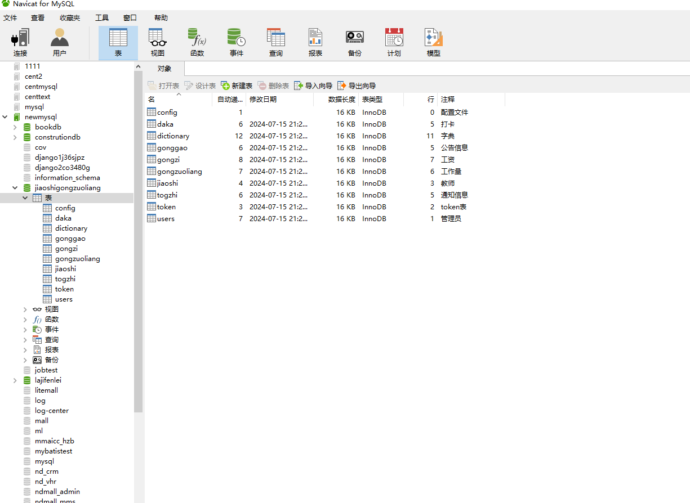
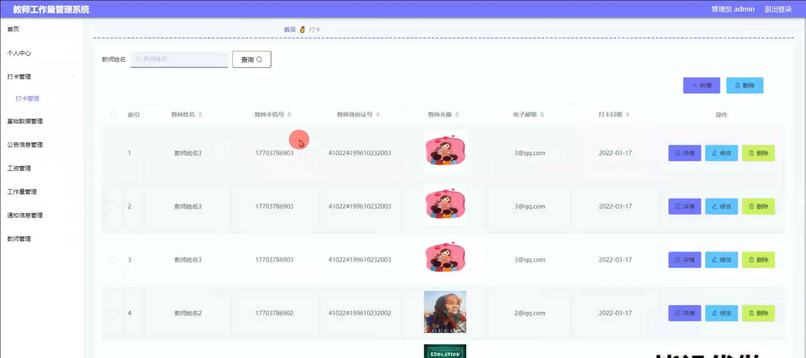
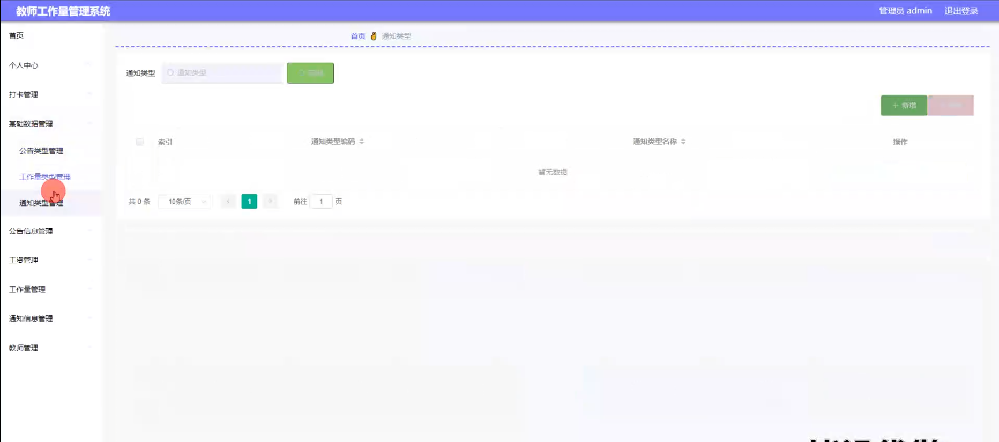
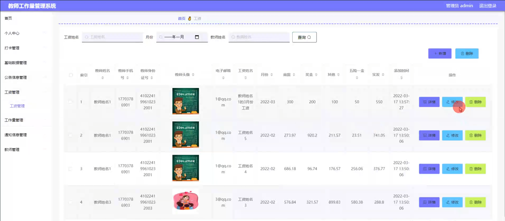
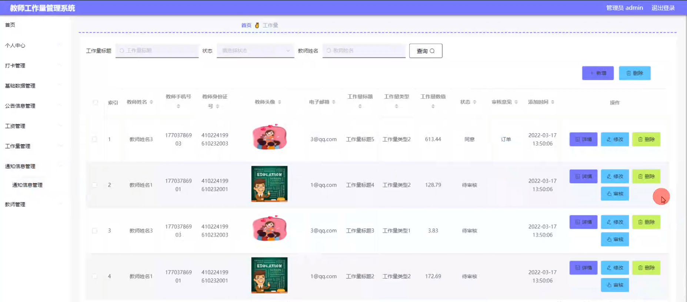
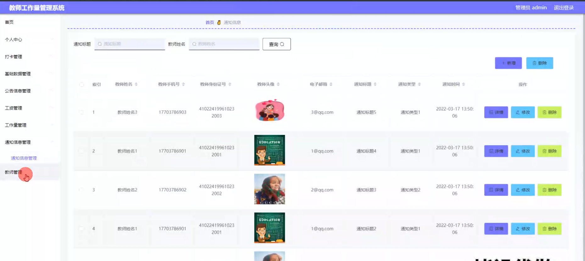
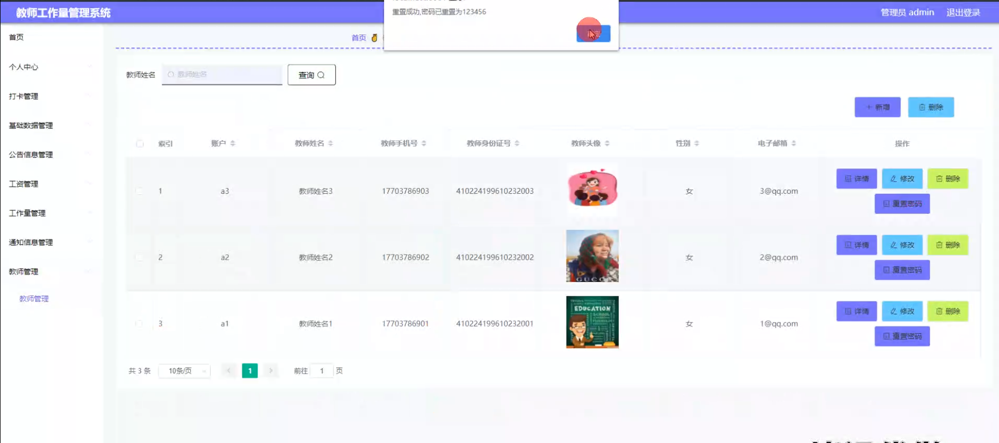
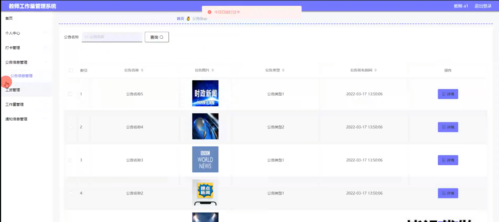

# 教师工作量管理系统

#### 介绍

在教育领域，对教师工作量的准确评估和有效管理对于保障教学质量、合理分配资源以及激励教师积极性具有至关重要的意义。然而，传统的教师工作量管理方式往往依赖于手工记录和繁琐的统计，容易出现误差、效率低下且缺乏透明度。
本基于 Spring Boot 的教师工作量管理系统旨在为学校或教育机构提供一个高效、精确、便捷的管理工具，实现对教师工作量的自动化统计、分析和管理，提高管理效率，促进教育教学工作的顺利开展。

#### 技术栈

后端技术栈：Springboot+Mysql+Maven

前端技术栈：Vue+Html+Css+Javascript+ElementUI

开发工具：Idea+Vscode+Navicate

#### 系统功能介绍

（一）管理员角色  
个人中心：管理员可在个人中心查看和修改自己的个人信息、登录密码等。  
打卡管理：  
查看教师的打卡记录，包括上班打卡时间、下班打卡时间等。  
对异常打卡情况进行处理，如迟到、早退、旷工等。  
基础数据管理：  
维护课程信息，包括课程名称、课程类别、学分等。  
管理教学班级信息，如班级名称、所属年级、学生人数等。  
设定教学任务的标准工作量，作为工作量计算的依据。  
公告信息管理：  
发布与教师工作相关的通知、公告，如教学安排调整、培训通知等。  
编辑和删除已发布的公告，确保信息的准确性和及时性。  
工资管理：  
根据教师的工作量、绩效等因素计算教师的工资。  
审核和发放教师工资，生成工资报表。  
工作量管理：  
统计教师的教学工作量，包括授课课时、辅导课时、批改作业量等。  
对教师的工作量进行分析和评估，为教学资源分配提供参考。  
通知信息管理：  
向教师发送个性化的通知，如工作安排变动、任务提醒等。  
查看通知的送达和阅读情况，确保教师及时获取重要信息。  
教师管理：  
管理教师的基本信息，如姓名、性别、学历、职称等。  
对教师进行岗位调配、职称评定等操作。  

（二）用户角色（教师）  
个人中心：教师可以在个人中心查看和修改个人信息。  
打卡管理：进行日常的上班和下班打卡操作。  
公告信息管理：及时查看学校发布的公告信息，了解学校的最新动态和工作安排。  
工资管理：查看自己的工资明细和发放记录。  
工作量管理：查看自己的工作量统计情况，了解各项教学任务的完成量。  
通知信息管理：接收学校或管理员发送的通知，并进行相应的回复和处理。  

#### 系统作用

提高管理效率  
自动化处理教师工作量的统计和计算，大大减少了人工操作的时间和错误。  

保障公平公正  
以客观的数据为依据进行工作量评估和工资计算，确保教师的付出得到合理回报。  

优化资源配置  
通过对教师工作量的分析，合理安排教学任务和分配教学资源。  

增强信息透明度  
教师能够清晰了解自己的工作情况和待遇，提升工作满意度。

#### 系统功能截图

代码结构

数据库表

登录

打卡管理

基础数据管理

工资管理

工作量管理

通知信息管理

教师管理

教师端公告信息

#### 总结

基于 Spring Boot 的教师工作量管理系统为教育机构的管理工作带来了显著的便利和改进。然而，该系统仍存在一些潜在的问题和需要完善的地方，例如在应对复杂的教学场景和特殊的工作量计算规则时，可能需要进一步优化算法和功能；系统的安全性和数据备份机制还需要不断加强，以防止数据丢失和泄露；对于与其他教育管理系统的集成和数据共享，还有待进一步探索和实现。未来，我们将持续改进和完善该系统，以更好地满足教育管理的实际需求，为提升教育质量和管理水平发挥更大的作用。

#### 使用说明

创建数据库，执行数据库脚本 修改jdbc数据库连接参数 下载安装maven依赖jar 启动idea中的springboot项目

后台登录页面
http://localhost:8080/jiaoshigongzuoliang/admin/dist/index.html

管理员				账户:admin 		密码：admin

教师				账户:a1 		密码：123456